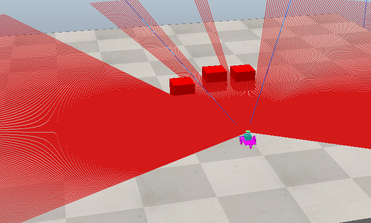
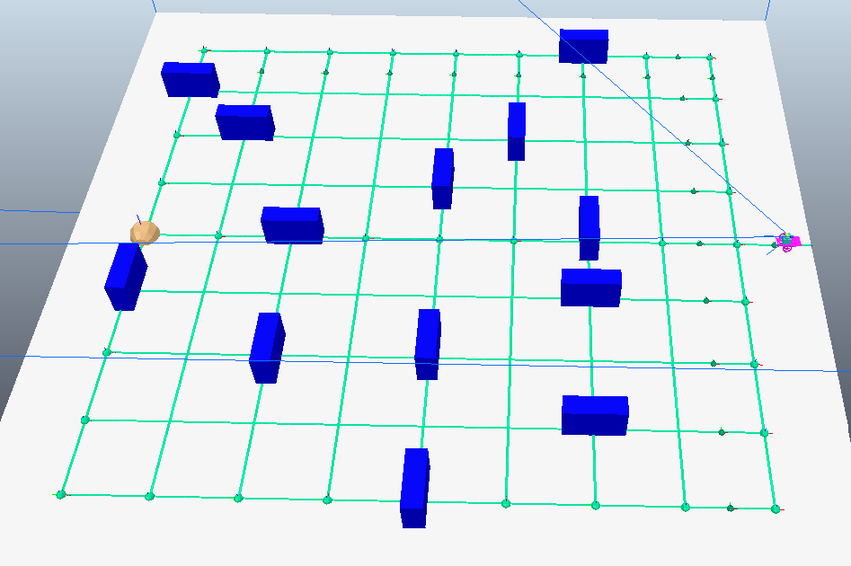
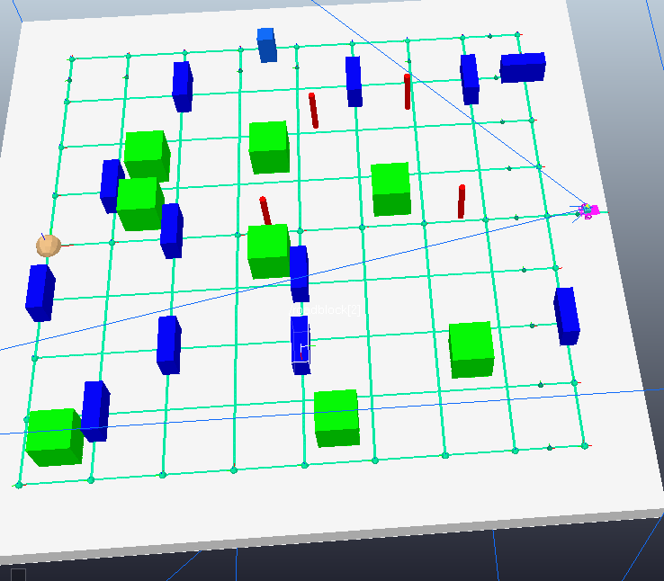
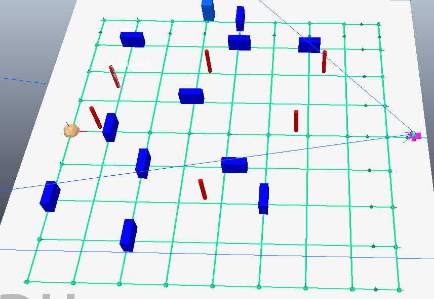

# Self-Driving Smart Car (Coppelia Waymo)

## Team Members & Roles
+ Ryan Shorter: 
  - Obstacle Logic
    - Created and arranged obstacles in roadmap simulation in multiple different scenes
    - Experimented with changes and ensuring sucessful simulations
    - Developed logic for vehicle's interaction with obstacles
    - Programmed path-planning to reroute A-Star accounting for new obstacles
  - Project write up
+ Joshua Kim:
  - Sensor/Vehicle Logic
    - Implemented sensor data to determine relevancy of obstacles
    - Controlled robot reaction and response to changes in environment
    - Experimented with varying measurable robot-vision thresholds
  - Project write up
+ Peyten Hargraves:
  - Sensor Implementation
    - Programmed LiDAR to collect angle and distance data of obstacles
    - Tested various situations of collecting LiDAR data
    - Built the robot to mount necessary sensors
    - Implemented RGB camera to integrate color into the LiDAR return data
+ Yechan Kim:
  - Developed A-Star
    - Designed CoppeliaSim Environment and associated A-Star programming
    - Integrated A-Star as a function by receiving data from sensors to be reactive
  - Compiled implementation of reinstating A-Star into Obstacle and Vehicle Logic

### Introduction
Our project is inspired by the challenges of self-driving smart cars. With an unpredictable world around them, with so many different variables and objects to account for, how do they perform their function while effectively ensuring the safety of not only the user, but the world around them as well? Products such as Waymo, use a complex network of cameras, LiDAR sensors, radar, as well as mapping, smart software, GPS and more to effectively analyze the world around them and react accordingly. 

In our project, we look to simulate this concept using various ECSE275 robotics concepts. The two we will focus on will be utilizing robot vision, to add a level of complexity in identifying the robot's surroundings, as well as A-Star but in a more reactive context as well as map-based planning.

Our demo will follow the smart car as it navigates through four courses: 1. Blue Obstacles Only, 2. Blue & Green Obstacles, 3. Blue & Red Obstacles, and 4. Blue, Green, & Red Obstacles

### Approach
We had four main building blocks that build up our system: Sensors, A-Star, Robot Logic, and Obstacle Logic, with A-Star being the backbone of our project. It dictated the initial position and movement of the robot. The sensor system would then analyse the world and continuously pass color, distance, and angle data to Obstacle Logic. Obstacle Logic would then determine what sets of data were relevant to act upon, which when true, would pass information to Robot Logic which will change the robot's behavior, which can be generalized to avoiding obstacles and moving to a point optimal for a new path. It would then re-run A-Star with taking into account the obstacle it encountered, which means Robot Logic is passing the new situation to A-Star, which will re-run and set the robot on a new course. 

We considered between using A-Star and Potential fields to reach our goal. Considering the benefits and costs of map-based planning and reactive planning as applied to our goals, we ended up deciding to use A-Star, as it would better represent a car traveling through a city using GPS. However, unexpected obstacles would necessitate for the path-planning to be reactive as well, which A-Star is not. To account for this, we developed a system that would autonomously reiterate A-Star, while updating the existing map that takes into account new data. 

When it comes to "seeing" the world around the robot, we do not have the resources in CoppeliaSim to utilize sensor networks to classify different types of obstacles, such as a red traffic light or a young child crossing the road. However, to simulate this vision, we have two different obstacles with different colors and shapes. Blue will represent designed roadblocks that point cars away from blocked off areas. Red obstacles will represent more natural or nuanced obstacles, such as people, who may look different, but deserve just as much attention as roadblocks do. It would be nice if this world had just obstacles and nothing else to look for. However, that is not the case as there are always going to be other objects around. To replicate this, we then added in green blocks to represent buildings inbetween our "roads". The existance of these should not deter the robot. 

<!-- What experiments did you conduct and what data did you collect to measure the performance and define success? -->

## Results

### Vision & Lidar Sensor
Vision and Lidar sensor obtains an obstable's color, distance, and angle based on the robot. Both are front facing, meaning it cannot identify obstac;es behind or to the sides. All of this data is combined to a list and sent to path planning as needed for the obstacle logic.

### A* Algorithm Path Planning
A* algorithm has paths that it can only take in an 8x8 grid where each intersection is a possible node for the robot to go towards until it reaches the goal point. If encountering a roadblock (blue) or person (red), it will assume the path towards the obstacle is cut off and reruns the algorithm to essentially go down a different direction. Any buildings (green) should be ignored. 

### Obstacle Courses
Here are the obstacle courses created for the demo:
| | | |
|:-------------------------:|:-------------------------:|:-------------------------:|
|  Course 1 Blue |   Course 2 Blue-Green|
| Course 3 Blue-Green-Red| Course 4 Blue-Red|

### Difficulties & Issues
* Obstacle Retention
  * Whenever the robot turns left or right from a roadblock, it tends to circle around into the roadblock from a different path.
  * The limited camera FOV, and how the code was written, does not allow the robot to identify obstacles at its sides, leading it to crash into an unknown obstacle.
* Vision Sensor & Lidar Integration
  * Although we could get the color, distance, and angle of object fairly straightfoward; we encountered difficulty in properly combining and creating the correct obstacle logic to enact upon said obstacle data
* Movement Stability
  * Whenever the robot moves, it will initially rock back-and-forth until stabilizing on the path. Especially noticable after every turn

### Conclusion
Overall, our project aims to replicate one of the many challenges that self-driving cars face. By utilizing various concepts explored in this class, particularly A-Star and Robot Vision, we built a simulation that represents a car traveling around a grid of roads while interacting with and taking account of various obstacles along the way. Our multiple environment represent increasingly complex and realistic environment for our robot to navigate through. Further improvements into the project would be to fix the robot's movement stability as well as greater consistency when interacting with obstacles. 

